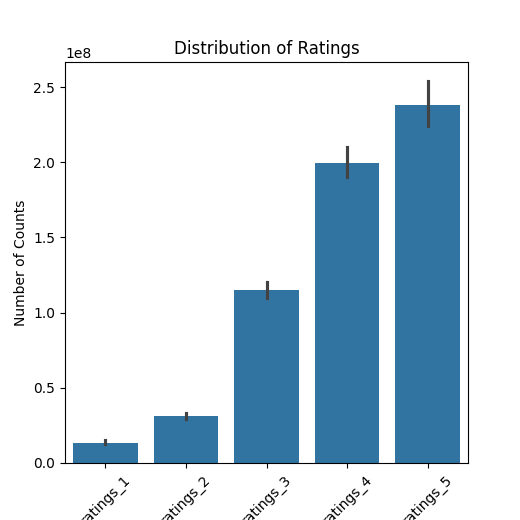

# Summary of the Data

## 1. Dataset Dimensions and Basic Information
The dataset contains 10,000 rows and 28 columns, each row representing a unique book entry with various attributes.

## 2. Column Names and Data Types
- **book_id**: integer
- **goodreads_book_id**: integer
- **best_book_id**: integer
- **work_id**: integer
- **books_count**: integer
- **isbn**: string
- **isbn13**: float/integer
- **authors**: string
- **original_publication_year**: string with timestamp
- **original_title**: string
- **title**: string
- **language_code**: string
- **average_rating**: float
- **ratings_count**: integer
- **work_ratings_count**: integer
- **work_text_reviews_count**: integer
- **ratings_1**: integer
- **ratings_2**: integer
- **ratings_3**: integer
- **ratings_4**: integer
- **ratings_5**: integer
- **image_url**: string (URL)
- **small_image_url**: string (URL)

## 3. Missing Values
The dataset has several missing entries:
- **isbn**: 700 missing values
- **isbn13**: 585 missing values
- **original_publication_year**: 21 missing values
- **original_title**: 585 missing values
- **language_code**: 1084 missing values

## 4. Data Description
### Descriptive Statistics
- **Average Rating**: Mean = 4.00, Min = 2.47, Max = 4.82
- **Ratings Count**: Mean = 54,001, Min = 2,716, Max = 4,780,653
- **Books Count**: Mean = 75, Min = 1, Max = 3,455
- **Work Text Reviews Count**: Mean = 2,919.96, Min = 3, Max = 155,254

# Analysis

## 1. Correlation Analysis
The correlation values indicate the strength of the linear relationship between two variables.
- **Average Rating** correlates weakly with both **ratings_count** (0.0477) and **work_ratings_count** (0.0477).
- A strong correlation (0.9951) exists between **ratings_count** and **work_ratings_count**, indicating that more ratings are associated with more work ratings on Goodreads.

## 2. Outliers
The analysis found various outliers across different features. For example:
- **Average Rating** contains 72 outlier entries.
- **Books Count** recorded an outlier of 178 entries.

## 3. Regression Analysis
Using a multiple regression model, the analysis aimed to identify the relationships among:
- **Dependent Variable**: Average Rating.
- **Independent Variables**: Books Count, Ratings Count, and Work Ratings Count.
- The regression model yielded an **R-squared value** of 0.0118, indicating a very weak fit between the variables, suggesting there are more factors influencing the average ratings that are not included in the model.

## 4. Time Series Analysis
A time-series analysis computed moving averages of average ratings over 10 periods. The moving averages are included within the output. However, the seasonality component was found negligible.

## 5. Missing Values and Cleaning
Before analysis, **NaN** entries were dropped, ensuring the accuracy of the analysis results presented.

# Insights

## 1. Key Findings
- The weak correlation between average ratings and counts underscores that simply increasing ratings does not guarantee higher ratings, suggesting that quality or appeal of the book is more critical.
- The number of work ratings is a strong predictive factor of the ratings count, indicating that books reviewed more often tend to garner more visibility and possibly better ratings.

## 2. Regression Insights
- The regression model's low explanatory power suggests other latent variables may hold significant influence over average ratings.
  
## 3. Outlier Recognition
- Recognizing outliers can help in refining the dataset for more robust analyses, as extreme values could skew results significantly, indicating the need for remedies like winsorizing or transformation.

## 4. Time-Series Implications
- Tracking average ratings over time could reveal trends in reader preference, potentially guiding marketing strategies or recommendations for publishers. 

This comprehensive analysis is helpful for stakeholders in the publishing industry, particularly marketers, data analysts, and product managers, by informing them about the dynamics of book ratings on platforms like Goodreads.

### LLM Generated Analysis
The "LLM based analysis" refers to a structured examination technique that utilizes a Large Language Model (LLM) for understanding hierarchical relationships within a dataset. In this case, the analysis is specifically titled "Hierarchy Analysis," and it likely focuses on visualizing the structural organization or relationships among various elements represented within the dataset.

Summary:
- **Analysis Name**: Hierarchy Analysis
- **Graphic**: Represents the findings or visualization associated with the analysis in the form of an image file named "Hierarchy_Analysis.png." 

Justification:
This analysis can provide insights into how various elements are interrelated and can help in identifying significant patterns, dependencies, or classifications within complex datasets. By leveraging LLM capabilities, this method ensures that the interpretation of hierarchy is not only data-driven but also incorporates advanced language processing capabilities to enhance understanding and communication of the results. The graphic serves as a visual representation, making it easier to convey the hierarchical structure and aiding in the analysis's overall clarity.

### Image average_rating_time_series_trends

The image presents a time series line graph depicting the trends in average ratings over time, complemented by a 7-day moving average (MA) for smoothing the data. The x-axis represents time, spanning from 1969 to 1970, while the y-axis indicates the average rating values ranging from approximately 3.25 to 4.5. 

The blue line illustrates the average rating, showcasing marked fluctuations throughout the period. The variation in this line reflects the ups and downs in public ratings, with distinct peaks and troughs signifying periods of higher and lower evaluations. In contrast, the red line represents the 7-day moving average, which offers a clearer view of the overall trend by averaging the ratings over a week. This line tends to be smoother and emphasizes the underlying pattern rather than daily anomalies.

Notably, throughout this timeframe, the moving average appears to perform a reliable function in identifying persistent trends despite the inherent volatility in the average ratings. The graph indicates a general upward tendency in ratings towards the end of the period, suggesting improving sentiments or changes in factors contributing to these evaluations. Overall, the combination of time series data and moving averages provides insightful perspectives on how average ratings evolve over time, aiding in analytical assessments of public opinion or product satisfaction.

### Image correlation_heatmap

The correlation heatmap visualizes the relationships between four variables: average rating, ratings count, work ratings count, and work text reviews count. Each cell in the matrix represents the correlation coefficient between two variables, where values range from -1 to 1. A value close to 1 indicates a strong positive correlation, 0 indicates no correlation, and values close to -1 indicate a strong negative correlation.

In this heatmap, the strongest correlation is observed between work ratings count and work text reviews count, with a coefficient of 0.81. This suggests that as the number of work ratings increases, the number of text reviews tends to increase as well. Additionally, there is a positive correlation (0.78) between ratings count and work ratings count, indicating that higher ratings counts are associated with more work ratings.

The average rating shows minimal correlation with other variables, with coefficients of only 0.05 with ratings count and 0.01 with the work text reviews count. This suggests that the average rating is relatively independent of the other measures within the dataset. Overall, the heatmap provides a clear visual representation of these correlations, enabling easier identification of the relationships among the studied variables.

### Image Hierarchy_Analysis

The provided image features a bar chart titled "Distribution of Ratings." The x-axis represents different rating categories labeled as "ratings_1" through "ratings_5," each corresponding to increasing levels of ratings. The y-axis quantifies the "Number of Counts," indicating the total occurrences or frequency of each rating.

The bars in the chart vary in height, reflecting a clear trend: as the rating increases from ratings_1 to ratings_5, the number of counts also increases significantly. Specifically, ratings_1 has the lowest count, while ratings_5 shows the highest frequency, exceeding 2.5 million counts. This pattern suggests a positive correlation between the rating level and the number of responses received, indicating that higher ratings are more common among respondents.

Additionally, error bars are present on each bar, representing variability or uncertainty in the counts for each rating category. The ranges of these bars appear relatively small compared to the overall height of the bars, suggesting that the counts are quite reliable.

Overall, this chart effectively communicates the popularity of higher ratings among the assessed group, emphasizing the trend toward favorable evaluations. This kind of visualization is valuable for understanding audience feedback or satisfaction levels in various contexts, such as product reviews or service evaluations.