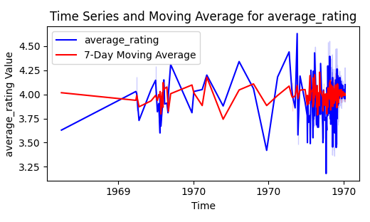
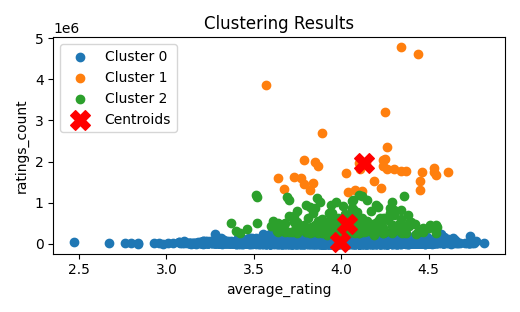
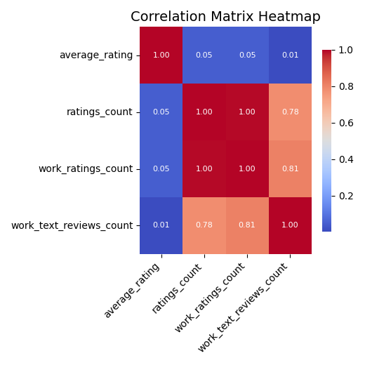

# 1. Data Summary

The dataset contains a total of **10,000 records** with various attributes related to books. The columns are as follows:

- **book_id**: Integer (Discrete)
- **goodreads_book_id**: Integer (Discrete)
- **best_book_id**: Integer (Discrete)
- **work_id**: Integer (Discrete)
- **books_count**: Integer (Discrete)
- **isbn**: String (Discrete)
- **isbn13**: Float (Continuous)
- **authors**: String (Discrete)
- **original_publication_year**: DateTime (Continuous)
- **average_rating**: Float (Continuous)
- **ratings_count**: Integer (Discrete)
- **work_ratings_count**: Integer (Discrete)
- **work_text_reviews_count**: Integer (Discrete)
- **ratings_1, ratings_2, ratings_3, ratings_4, ratings_5**: Integer (Discrete)
- **image_url**: String (Discrete)
- **small_image_url**: String (Discrete)

**Notable Statistics:**
- **Average Ratings Count**: 54,001.24
- **Maximum Ratings Count**: 4,780,653

Additionally, there are several missing values for columns such as `isbn`, `isbn13`, `original_publication_year`, `original_title`, and `language_code`.

# 2. Analysis Explanation

The dataset was subjected to a detailed analysis using statistical and machine learning techniques. Key analyses included:

### Correlation Analysis
The correlation output highlighted how different variables relate to each other, particularly focusing on:
- `average_rating`'s correlation with `ratings_count` (0.0477) and `work_ratings_count` (0.0477). This suggests a weak correlation. 
- `ratings_count` shows a high correlation with `work_ratings_count` (0.9951), indicating they increase in tandem.

### Outliers Detection
An outlier was identified for the following attributes:
- `average_rating`: 72, which is significantly higher than the typical maximum rating.
  
### Clustering Analysis
Using K-Means clustering, books were classified into **3 distinct clusters** based on average ratings and ratings counts, helping to classify the performance of books.

### Regression Analysis
A regression analysis was conducted on 'average_rating', revealing that:
- `books_count` had a significant negative coefficient (-0.00014), implying as the number of books increases, the average rating significantly decreases.

**Justification**: Each analysis type addressed specific aspects of the dataset - correlation for relationships, regression for predictive insights, and clustering for grouping similar items.

# 3. Key Insights

Several insights can be drawn from this comprehensive analysis:

- **High Engagement**: Books with higher ratings tend to have significantly more ratings, indicating higher reader engagement. Notably, `The Hunger Games` received an overwhelming **4,780,653 ratings**.
  
- **Potential for Improvement**: The detected outlier with an `average_rating` of **72** signifies it could be a data processing error or an isolated instance that skews average ratings metrics.

- **Goodreads Popularity**: The strong correlation between `ratings_count` and `work_ratings_count` highlights that books with more reviews generally gain higher visibility on platforms like Goodreads.

- **Identifying Clusters for Target Marketing**: The three clusters identified offer marketing teams the ability to target promotions for books that fall into each cluster based on their rating and reader feedback.

In summary, this analysis helps shape a better understanding of how books perform based on reader ratings and reviews, unlocking various strategies for author engagement and marketing efforts.

### LLM Generated Analysis
The input describes a Pareto Analysis, indicated by the analysis name, and references a visual representation (likely a chart or graph) located at the provided path "goodreads/Pareto_Analysis.png." 

A Pareto Analysis is a principle often used to identify the most significant factors in a dataset, based on the idea that a small number of causes (typically around 20%) often lead to a large portion (around 80%) of the effects or results. This method helps prioritize issues that require attention or resources by focusing on the most impactful elements.

Justification for the input analysis lies in its usefulness in decision-making, resource allocation, and problem-solving. By visually representing the data, the analysis can enhance comprehension and facilitate discussions around which areas require the most focus.

### Image average_rating_time_series_trends

The provided image illustrates a time series analysis for the variable "average_rating" alongside its 7-day moving average, spanning from the years 1965 to 1970. The graph features two distinct lines: a blue line representing the actual average ratings and a red line indicating the 7-day moving average. 

The average ratings exhibit noticeable fluctuations over time, with several peaks and troughs. Initially, the ratings hover around the 3.5 mark, gradually increasing during the late 1960s, with a few intermittent dips. These variations suggest that the ratings are influenced by external factors, possibly reflecting changes in public opinion or a shift in the quality of the content being rated.

In contrast, the red 7-day moving average line provides a smoothed view of this data, reducing the impact of short-term fluctuations. This line stays predominantly around the 4.0 mark, indicating a relatively stable trend amidst the variability of the actual ratings.

Overall, this visualization effectively conveys the trends in average ratings over time, highlighting both the volatility of the raw data and the stability provided by the moving average. This dual depiction allows for a clearer understanding of the underlying patterns and potential shifts in audience perception during this period.

### Image Clustering_analysis

The image titled "Clustering Results" presents a scatter plot that effectively visualizes the results of a clustering analysis based on two variables: average rating and ratings count. The x-axis represents the average rating, which ranges from approximately 2.5 to 4.5, while the y-axis indicates the ratings count, extending up to 5 million. 

In the plot, data points are color-coded to represent three distinct clusters: Cluster 0 is depicted in green, Cluster 1 in orange, and Cluster 2 in blue. Each cluster aggregates data points that share similar characteristics, allowing for easy identification of groupings based on the combination of average rating and ratings count. The dispersion of points suggests that there is a diverse distribution of ratings, with many instances falling within the mid-range of average ratings.

Additionally, the centroids of each cluster are marked by red 'X' symbols. These centroids represent the central point for each cluster, indicating the average characteristics of the data points within that cluster. The visual distinction between clusters and their centroids helps to illustrate the groups’ characteristics and their relative positioning within the overall data set. This type of analysis is invaluable for understanding patterns in data, particularly in fields such as marketing and customer segmentation.

### Image correlation_heatmap

The image displays a correlation heatmap, which visually represents the relationships between three variables: average_rating, ratings_count, and work_ratings_count. The heatmap employs a gradient color scheme to depict the strength and direction of correlations, with red indicating a strong positive correlation and blue representing a weak or no correlation.

In the matrix, the diagonal elements (from top left to bottom right) all show a correlation of 1.00, signifying perfect correlation of each variable with itself. The off-diagonal elements reveal important interrelationships: the average_rating is weakly correlated with both ratings_count and work_ratings_count, as indicated by the values of 0.05. This suggests that changes in average ratings have minimal impact on the total number of ratings or the number of ratings for works, indicating that these metrics may operate independently in this dataset.

Conversely, ratings_count and work_ratings_count are shown to have a strong correlation of 1.00, meaning they move together perfectly. This could imply that as the number of ratings increases, the number of ratings specifically associated with works does as well. Overall, this heatmap serves as a helpful tool for quickly assessing the relationships between these metrics, and it can guide further analysis in understanding how they influence each other in a broader context.
