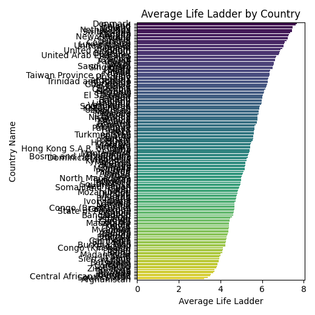
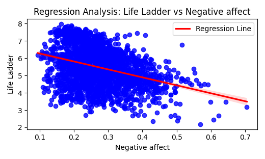

# 1. Summary of the Data

### Dimensions of the Dataset
The dataset contains **2363 rows** and **10 columns**. Below are the columns along with their data types:

| Column Name                               | Data Type                     |
|-------------------------------------------|-------------------------------|
| Country name                              | Object                        |
| year                                      | Discrete (Integer-based)      |
| Life Ladder                               | Continuous                    |
| Log GDP per capita                        | Continuous                    |
| Social support                            | Continuous                    |
| Healthy life expectancy at birth          | Continuous                    |
| Freedom to make life choices              | Continuous                    |
| Generosity                                | Continuous                    |
| Perceptions of corruption                 | Continuous                    |
| Positive affect                           | Continuous                    |
| Negative affect                           | Continuous                    |

### Additional Data Characteristics
- The **Country name** column has **165 unique** entries with **'Argentina'** as the most frequent entry (18 occurrences).
- The **year** column encodes information ranging from **2005** to **2023**, with a mean year of **2014.76**.
- Several columns have missing values, notably **Generosity** (81 entries), **Perceptions of corruption** (125 entries), and **Healthy life expectancy at birth** (63 entries).

### Missing Values Summary
The columns with missing values and their respective counts are:
- Log GDP per capita: 28 missing
- Social support: 13 missing
- Healthy life expectancy at birth: 63 missing
- Freedom to make life choices: 36 missing
- Generosity: 81 missing
- Perceptions of corruption: 125 missing
- Positive affect: 24 missing
- Negative affect: 16 missing

# 2. Explanation of the Analysis

The analysis conducted includes correlation analysis, outlier analysis, regression analysis, and data description.

### Correlation Analysis
Correlation analysis was performed to explore the relationships between different metrics. The correlation coefficients reveal that:
- **Log GDP per capita** shows a strong positive correlation (approximately 0.79) with **Life Ladder**, and **Social support** also holds a significant correlation (approximately 0.72).
- **Healthy life expectancy** likewise demonstrates a substantial positive correlation with **Life Ladder** (approximately 0.73) and **Log GDP per capita** (approximately 0.83).

### Outlier Analysis
The analysis identified various outliers across different columns:
- Life Ladder: 2 outliers.
- Log GDP per capita: 3 outliers.
- Social support: 23 outliers.
- Healthy life expectancy at birth: 14 outliers.
- Generosity: 21 outliers.
- Perceptions of corruption: 34 outliers.

### Advanced Analysis Output
Regression analysis utilizing various features was conducted. The key findings are summarized below:
- The R-squared value of approximately **0.779** indicates that about 77.9% of the variance in the Life Ladder can be explained by the independent variables considered.
- Key coefficients derived from the regression including:
  - **Log GDP per capita**: 0.388
  - **Social support**: 1.887
  - **Freedom to make life choices**: 0.448
  - **Positive affect**: 2.236
  - Notably, **Perceptions of corruption** is negatively correlated (-0.707).

### Handling Missing Data
During the analysis, missing values (NaNs) from the dataset were omitted to ensure robustness in the regression modeling.

# 3. Insights Derived from the Analysis

- **Strongest Influencers**: Among the metrics assessed, **Social support** and **Positive affect** are paramount influencers on the Life Ladder scores, indicating that happiness and emotional well-being are critical factors in the perceived quality of life.
- **Economic Influence**: The **Log GDP per capita** shows a substantial positive correlation with the **Life Ladder**, underlying the importance of economic factors in enhancing life satisfaction.
- **Perception of Corruption**: The negative coefficient for **Perceptions of corruption** emphasizes that greater perceptions of corruption are associated with lower Life Ladder scores, highlighting the detrimental effects of corruption on societal well-being.
- **Health Variables**: **Healthy life expectancy** plays a significant role in contributing to greater life satisfaction, reinforcing the tie between public health and quality of life.

In summary, the analysis effectively underscores the multi-dimensionality of quality of life indicators, illustrating the intricate web of socio-economic and emotional factors at play.

### LLM Generated Analysis
**Summary**: The "Hierarchy Analysis" is a study that focuses on evaluating the average Life Ladder score across different countries. The Life Ladder is a measure of subjective well-being, where individuals rate their current lives on a scale of zero to ten. This analysis aims to provide insights into how different countries rank in terms of life satisfaction based on this score.

**Justification**: This summary encapsulates the primary objective of the analysis, which is to assess and compare life satisfaction levels among various nations. By highlighting the average Life Ladder score, the analysis reflects broader socio-economic factors and quality of life indicators that contribute to subjective well-being in different cultural and geographical contexts.

### Image correlation_heatmap

The correlation heatmap provides a visual representation of the relationships between various indicators that measure well-being and quality of life. The key variables included are "Life Ladder," "Log GDP per capita," "Social support," "Healthy life expectancy at birth," and "Freedom to make life choices."

In this heatmap, each square indicates the strength of the correlation between two variables, with darker shades representing stronger correlations. The "Life Ladder" shows the highest correlation (1.00) with itself, as expected. It has a strong positive correlation with "Log GDP per capita" (0.79) and "Social support" (0.72), suggesting that higher GDP and better social networks are associated with increased subjective well-being.

"Healthy life expectancy at birth" also shows notable correlations, with a moderate relationship to the "Life Ladder" (0.63) and "Social support" (0.60). This indicates that the healthier the population, the higher the reported life satisfaction. Meanwhile, "Freedom to make life choices" showcases the lowest correlations across the indicators, with a maximum correlation of 0.53 with "Life Ladder."

Overall, the heatmap illustrates that economic stability, social connections, and health significantly contribute to life satisfaction, whereas freedom in making personal choices also plays a role but not as strongly. This visual analysis underlines the interconnectedness of these factors in enhancing overall well-being.

### Image Hierarchy_Analysis

The provided image presents a bar graph titled "Average Life Ladder by Country," depicting the average life ratings assigned to various countries, likely based on metrics of well-being or happiness. Each country is listed along the vertical axis, while the horizontal axis represents the average life ladder score ranging from 0 to 8. 

The countries are arranged in a descending order of their life ladder scores, creating a visual effect that highlights disparities in life satisfaction across different regions. The gradient color scheme from yellow to purple indicates increasing scores, enhancing the visual appeal and providing an intuitive way to gauge how countries compare. 

Notably, countries with higher scores are shown on the right side of the graph, with darker colors indicating better average life rankings. In contrast, lower-scoring countries populate the left, represented by lighter colors. This layout emphasizes the significant differences in perceived quality of life and suggests a correlation between geographical and socio-economic factors.

Overall, the graph effectively communicates the variations in life satisfaction across nations, allowing viewers to quickly identify which countries rank higher or lower on the life ladder scale. The clarity of the visualization and its logical organization make it an effective tool for understanding global well-being disparities.

### Image Regression_Analysis__Life_Ladder_vs_Negative_affect

The image displays a scatter plot titled "Regression Analysis: Life Ladder vs Negative Affect." On the x-axis, we have "Negative affect," which measures the level of negative emotions, ranging from 0 to 0.7, while the y-axis represents the "Life Ladder," a scale indicative of subjective well-being, with values extending from 0 to 8. 

The plot consists of numerous blue dots, each representing a data point that correlates negative affect with life satisfaction. A noticeable trend is observed in the regression line, depicted in red, which slopes downward from left to right. This descending line indicates an inverse relationship between the two variables: as negative affect increases, the Life Ladder score tends to decrease. 

The density of data points suggests that a significant number of individuals report higher levels of negative affect when experiencing lower life satisfaction. The visual representation effectively illustrates the general tendency that increased negative emotions correlate with diminished well-being. The data implies that interventions aimed at reducing negative feelings could potentially enhance life satisfaction, highlighting an important area for psychological research and practical applications. This analysis underscores the critical relationship between emotional well-being and subjective life evaluations.