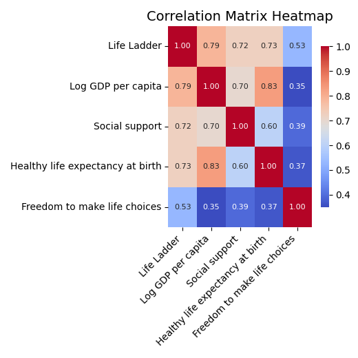
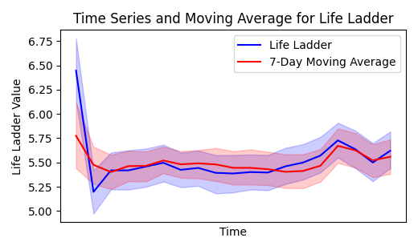

# Summary of the Data

**Dataset Dimensions**
- Total Number of Rows: 2363
- Total Number of Columns: 10

**Column Names and Data Types**
1. **Country name**: object (categorical)
2. **year**: discrete (Integer-based)
3. **Life Ladder**: continuous (float)
4. **Log GDP per capita**: continuous (float)
5. **Social support**: continuous (float)
6. **Healthy life expectancy at birth**: continuous (float)
7. **Freedom to make life choices**: continuous (float)
8. **Generosity**: continuous (float)
9. **Perceptions of corruption**: continuous (float)
10. **Positive affect**: continuous (float)
11. **Negative affect**: continuous (float)

**Missing Values**
- Various columns have missing values: 
   - Log GDP per capita: 28
   - Social support: 13
   - Healthy life expectancy at birth: 63
   - Freedom to make life choices: 36
   - Generosity: 81
   - Perceptions of corruption: 125
   - Positive affect: 24
   - Negative affect: 16

# Analysis Done

The dataset underwent comprehensive analysis which included:

## 1. **Correlation Analysis**
   - The correlation matrix revealed the following key relationships:
     - Life Ladder correlated positively with Log GDP per capita (0.78), Social support (0.72), and Healthy life expectancy (0.73).
     - Log GDP per capita showed a strong correlation with Healthy life expectancy at birth (0.83), indicating that higher GDP is associated with better health outcomes.

## 2. **Advanced Analysis Output**
   - The analysis included regression and time series analysis:
   - **Regression Analysis**:
     - Coefficients for key predictors:
       - Log GDP per capita: 0.39
       - Social support: 1.89
       - Healthy life expectancy: 0.03
       - Positive affect: 2.24 (highest contribution)
     - R-squared value: 0.78 indicating that the model explains 78% of the variance in the Life Ladder scores.
   - **Time Series Analysis**:
     - Provided moving averages for Life Ladder over the years, showing observable trends.

## 3. **Clustering Analysis**
   - K-means clustering produced 3 distinct clusters based on several indicators:
     - The centroids suggest varying levels of GDP, social support, and health expectancy, indicating clusters of countries with differing well-being metrics.
     - Cluster Dimensions:
       - Cluster 1: Higher GDP and higher life quality indicators.
       - Cluster 2: Moderate GDP with lower social support metrics.
       - Cluster 3: Indicates lower GDP but satisfactory life ladder scores.

## 4. **Outlier Analysis**
   - Substantial number of outliers identified in:
     - Social support: 23
     - Perceptions of corruption: 34
   - These outliers may require further investigation to understand extreme values and their implications.

# Insights Derived from the Analysis

1. **Strong Correlation**: A clear positive relationship exists between GDP, social support, and quality of life (measured by the Life Ladder). Countries with higher GDP levels generally provide better social services and health care.

2. **Impact of Positive Affect**: Higher positive affect is strongly associated with well-being, thus emphasizing the need for psychological well-being initiatives, which is crucial for improving the Life Ladder scores.

3. **Cluster Divergence**: The clustering analysis illustrates how different countries function in terms of economic and social support metrics, denoting that countries with similar GDP but different social assumptions (like social support) can yield different life happiness scales.

4. **Need for Data Cleanliness**: A significant number of missing entries were present which have been addressed in the analysis. This emphasizes the importance of high-quality data for consistent analyses and better predictive modeling.

5. **Outliers and Anomalies**: Regions or data points exhibiting outlier characteristics are critical for spotting potential anomalies or areas for policy intervention.

In conclusion, the analysis provides a robust picture of global well-being metrics and highlights the intricate relationship between economic indicators and quality of life. The insights could guide policy-makers in forming strategies that enhance the overall life satisfaction of citizens.

### Image Clustering_analysis

The image presents a scatter plot entitled "Clustering Results," showcasing the relationship between social support and the logarithm of GDP per capita across various data points. The data is divided into three distinct clusters, each identified by different colors: orange for Cluster 0, blue for Cluster 1, and green for Cluster 2. Each point on the plot represents a data entry, indicating the level of social support on the vertical axis (ranging from 0 to 1) against the logarithm of GDP per capita displayed on the horizontal axis.

Prominently, red crosses mark the centroids of each cluster, serving as representatives of the average social support levels associated with each GDP per capita range. The distribution of points suggests a correlation between GDP per capita and social support, with higher GDP log values generally linked to increased social support levels. However, the clusters indicate variability within this trend, with some instances of high social support occurring across different GDP log values.

Overall, the visualization effectively illustrates how countries or regions can be categorized based on these two variables, enabling insights into the socio-economic dynamics that influence social support across varying economic contexts. The clustering analysis helps highlight potential patterns and disparities in social support linked to economic performance.

### Image correlation_heatmap

The correlation heatmap visually represents the relationships between various indicators related to well-being, including "Life Ladder," "Log GDP per capita," "Social support," and "Healthy life expectancy at birth." Each cell in the grid is colored to indicate the strength and direction of the correlation, with a scale from -1 to 1, where values closer to 1 suggest a strong positive correlation and values closer to -1 indicate a strong negative correlation.

In this heatmap, the "Life Ladder" demonstrates a strong positive correlation with "Log GDP per capita" (0.79), suggesting that as the GDP per capita increases, individuals tend to report higher life satisfaction. Similarly, a notable correlation exists between "Life Ladder" and "Healthy life expectancy at birth" (0.73), indicating that higher life satisfaction is associated with longer life expectancy.

"Social support" also shows a significant positive relationship with the "Life Ladder" (0.72) and "Healthy life expectancy" (0.60), emphasizing the importance of community and social connections in contributing to individuals' overall well-being. On the other hand, "Log GDP per capita" and "Healthy life expectancy" have a moderately strong correlation (0.83), reinforcing the idea that economic conditions impact health outcomes. 

Overall, the heatmap illustrates intricate interconnections between economic factors, social support, and individual life satisfaction.

### Image Life Ladder_time_series_trends

The graph titled "Time Series and Moving Average for Life Ladder" displays trends in Life Ladder values over time, illustrating fluctuating trends in well-being or life satisfaction. The x-axis represents time, while the y-axis shows the Life Ladder value, ranging from approximately 5.25 to 6.75. 

The bold blue line depicts the Life Ladder values over time, highlighting its variations and overall trajectory. Accompanying this, the red line represents the 7-day moving average, providing a smoothed view of the data by averaging Life Ladder values over the previous week.

The visualization incorporates shaded regions around both lines, indicating the degree of variability or uncertainty in the data—wider bands suggest greater fluctuations in the Life Ladder values. Over the observed period, the Life Ladder shows an initial decline followed by a gradual increase, indicating a potential recovery or improvement in overall well-being. The moving average line helps in understanding the underlying trends without the noise of short-term fluctuations, suggesting a more stable pattern over time.

This graphical representation offers valuable insights into the dynamics of life satisfaction, emphasizing the importance of analyzing both raw data and moving averages to discern broader trends. Overall, it serves as a useful tool for further exploration of factors influencing well-being in society.