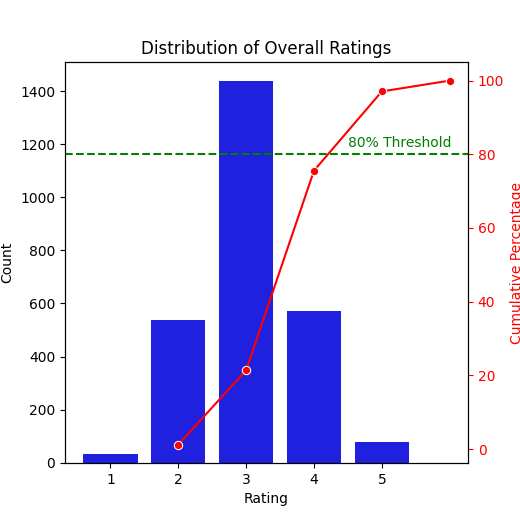

# Summary of the Data

## Dimensions and Structure
The dataset comprises a total of **2652** records and **8** columns. 

## Column Names and Data Types
The columns in the dataset are as follows:

1. **date**: Object (Date)
2. **language**: Object (String)
3. **type**: Object (String)
4. **title**: Object (String)
5. **by**: Object (String)
6. **overall**: Integer (Discrete)
7. **quality**: Integer (Discrete)
8. **repeatability**: Integer (Discrete)

## Missing Values
The dataset shows some missing values:
- **date**: 99 entries
- **by**: 262 entries

## Numeric Data Types
The columns `overall`, `quality`, and `repeatability` are identified as discrete (integer-based) data types.

# Analysis Performed

## Correlation Analysis
The correlation between the `quality` and `repeatability` metrics was examined, revealing a correlation coefficient of approximately **0.312**. This suggests a moderate positive correlation between `quality` and `repeatability`—as the quality increases, so does repeatability, although they are not strongly correlated.

## Outlier Detection
An outlier analysis showed that there were no outliers in the `overall`, `quality`, and `repeatability` metrics. This allows for a more reliable interpretation of other analyses without the influence of anomalous data points.

## Regression Analysis
A linear regression analysis was performed using the coefficients for `quality` and `repeatability`:
- Coefficient for `quality`: **0.7046**
- Coefficient for `repeatability`: **0.3719**

This indicates that for every unit increase in `quality`, the dependent variable (assumed to be overall rating or satisfaction) increases by approximately **0.7046**, holding `repeatability` constant. The model has an **R-squared value of 0.759**, which signifies that about **75.9%** of the variance in the dependent variable can be explained by the model. Both `quality` and `repeatability` exhibit statistically significant p-values, validating their contribution to the model.

# Insights Derived from the Analysis

- There exists a moderate correlation between quality and repeatability. Improving the quality of movies can potentially enhance repeatability, influencing how often people choose to revisit certain titles.
  
- The regression model performed well, indicating a solid relationship between movie quality and overall ratings. This is crucial for content creators and marketers looking to enhance viewer experiences.

- The dataset exhibits a high frequency of missing values in the `by` column (262 entries). This may affect the analysis of producers or directors' impact, suggesting a potential area for data improvement.

- The lack of outliers in the dataset strengthens the validity of these analyses, simply highlighting that the existing data distributions regarding quality and overall ratings are behaving as expected.

- Given the analysis is robust, efforts could be focused on enhancing movie quality as a means to improve viewer satisfaction and likelihood of repeat viewings.

### LLM Generated Analysis
The analysis presented is a Pareto Analysis, which identifies the frequency and cumulative impact of various ratings within a dataset. The summary indicates the distribution of ratings from 1 to 5 along with their corresponding counts, cumulative counts, and cumulative percentages.

Justifying the analysis, we observe the following:

- **Rating 1** has a count of 32, making up roughly 1.21% of the total responses.
- **Rating 2** shows a significant increase with 536 counts, contributing to approximately 21.42% of the total.
- **Rating 3** holds the highest count at 1436, representing about 75.57% cumulative percentage, indicating it is the most common rating among respondents.
- **Rating 4** has 570 responses, resulting in a cumulative percentage of 97.06%, suggesting that ratings of 4 and below account for the majority of the feedback.
- **Rating 5** has the lowest count at 78, making up the remaining 2.94% of the total.

Overall, this analysis showcases that a large portion of ratings skew towards the higher end, suggesting a positive sentiment. However, the low count of rating 5 implies room for improvement or an opportunity to understand what could enhance user satisfaction further. The cumulative percentages also elucidate that nearly all ratings (97.06%) fall within the top four categories, characteristic of the 80/20 rule prevalent in Pareto analyses—indicating that the majority of outcomes (ratings) are driven by a minority of inputs (individual ratings).

### Image correlation_heatmap

The correlation heatmap visually represents the relationship between two variables: "quality" and "repeatability." The matrix is structured in a grid format, with both variables displayed along the axes. The diagonal cells, where each variable intersects with itself, show a correlation coefficient of 1.0, indicating a perfect positive correlation, as expected.

The off-diagonal cell, which represents the correlation between "quality" and "repeatability," displays a value of 0.31. This positive correlation suggests a moderate relationship; as one variable increases, the other tends to increase as well, albeit not strongly. The color gradient, transitioning from deep red (indicating strong correlation) to deep blue (indicating weak correlation), further emphasizes the strength of these relationships. 

The heatmap helps to quickly assess the relationship between the two variables, making it clear that while they are positively correlated, the strength of that correlation is moderate rather than strong. This visualization aids in understanding how these two factors might interact or influence one another, which can be crucial for data analysis and decision-making processes. Overall, the heatmap effectively communicates information about variable relationships in a concise manner, allowing for easier interpretation and analysis.

### Image Pareto_Analysis

The image depicts a Pareto analysis, often used to identify the most significant factors in a dataset. It displays a bar chart alongside a cumulative line graph, effectively illustrating the distribution of overall ratings.

The x-axis represents different rating categories, ranging from 1 to 5, while the y-axis indicates the count of responses for each rating. The blue bars highlight the frequency of ratings at each level, where the most common rating appears to be 3, followed by 4, with significantly fewer instances of ratings 1 and 5. This visual representation emphasizes that the majority of ratings cluster around the middle range, showcasing a typical "bell curve" distribution.

In addition, there's a red line indicating the cumulative percentage of responses, which rises sharply as the ratings increase. The green dashed line marks the 80% threshold, suggesting that a considerable portion of the total ratings is achieved by focusing on the higher ratings, particularly 3 and 4. This analysis can help stakeholders identify areas for improvement efficiently, confirming the Pareto principle that a minority of causes often lead to the majority of effects. Overall, this visual tool facilitates quick insights into performance ratings, guiding decision-makers towards impactful changes.

### Image Regression Analysis: overall vs repeatability

The provided scatter plot illustrates a regression analysis comparing "overall" scores against "repeatability" values. Each point on the graph represents a data pair, where the x-axis denotes repeatability (ranging from 1.0 to about 3.0) and the y-axis shows overall scores (ranging from approximately 3 to 5).

The data points are plotted as blue circles, emphasizing their distribution across the two dimensions. A red regression line is applied to the scatter, indicating the trend of the relationship between the variables. The line appears to have a positive slope, suggesting that as repeatability increases, the overall scores also tend to increase. This relationship implies a direct correlation, where improved repeatability is associated with higher overall performance.

Importantly, while the overall trend seems positive, individual data points exhibit variability around the regression line, reflecting natural deviations in the data. Some points may be significantly above or below the predicted values represented by the line, implying that while there is a general trend, exceptions exist. This analysis serves to highlight the significance of understanding both the direction and the strength of the relationship between variables, which is crucial for further statistical insights in practical applications.