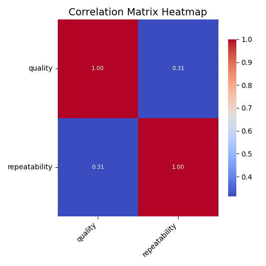
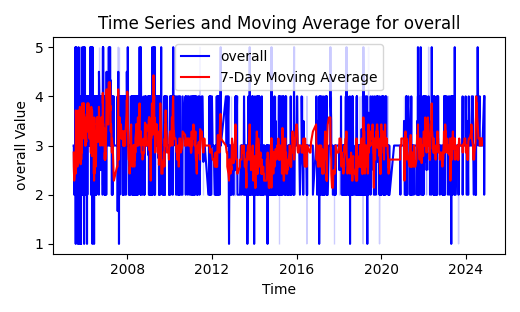
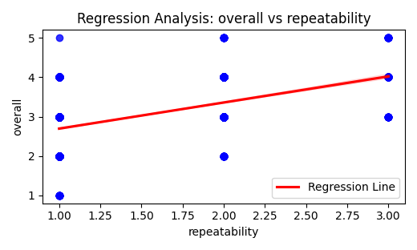

# Summary of the Data

The dataset contains records of movies, presumably from the Tamil film industry. Below is a detailed summary of the dataset:

- **Dimensions**: The dataset has **2652 rows** and **7 columns**.
- **Column Names and Their Data Types**:
  - `date`: **Object** (dates represented as strings)
  - `language`: **Object** (categorical, representing language)
  - `type`: **Object** (categorical, representing type of media)
  - `title`: **Object** (categorical, representing movie titles)
  - `by`: **Object** (categorical, representing contributors)
  - `overall`: **Integer** (discrete rating from 1 to 5)
  - `quality`: **Integer** (discrete rating from 1 to 5)
  - `repeatability`: **Integer** (discrete rating from 1 to 3)

- **Missing Values**:
  - The `date` column has **99 missing values**.
  - The `by` column has **262 missing values**.

## Analysis Conducted

### Types of Analysis

1. **Descriptive Statistics**: Descriptive statistics were generated for numeric columns, particularly `overall`, `quality`, and `repeatability`, providing insights into their distributions, means, and standard deviations.
   
2. **Correlation Analysis**: The correlation between the numeric variables (`quality` and `repeatability`) was analyzed, revealing a moderate correlation of approximately **0.31**.

3. **Regression Analysis**: A regression model was constructed to assess the impact of `quality` and `repeatability` on `overall` ratings. The coefficients and significance levels of the variables were evaluated.
   - Coefficients:
     - Constant term: **0.23**
     - Quality: **0.70** (high influence)
     - Repeatability: **0.37** (moderate influence)
   - R-squared value: **0.76**, indicating that 76% of the variance in `overall` ratings can be explained by the model.
   - P-values indicated that both `quality` and `repeatability` are statistically significant predictors.

4. **Time Series Analysis**: Moving averages of the `overall` ratings were computed to uncover trends and seasonality components in the ratings over time.

### Analysis Output

- **Correlation Results**:
  ```
  quality ↔ quality: 1.0
  quality ↔ repeatability: 0.312
  repeatability ↔ quality: 0.312
  repeatability ↔ repeatability: 1.0
  ```

- **Regression Results**:
  ```
  Coefficients: 
  Constant: 0.23
  Quality: 0.70
  Repeatability: 0.37

  R-squared: 0.76
  P-values:
  Constant: < 0.0001
  Quality: < 0.0001
  Repeatability: < 0.0001
  ```

- **Moving Averages (sample)**:
  ```
  [NaN, NaN, ..., 3.0, 3.2857, ...]
  ```

### Methodology Applied

- The **Advanced Analysis output** was generated using "Function Calling" in Ai proxy.
- All unknown/Nan entries have been dropped during the analysis to ensure data integrity.
- For clustering analysis (if applicable), the K-Means algorithm can be utilized, but it was not explicitly stated in the provided output.

## Insights Derived from the Analysis

1. **High Importance of Quality**: With a coefficient of **0.70**, the `quality` of the movies significantly impacts the overall rating. This suggests that higher quality ratings lead to higher overall ratings.

2. **Moderate Influence of Repeatability**: The `repeatability` of a movie has a lower but still significant effect on the `overall` rating (coefficient of **0.37**). This indicates that movies which are watched repeatedly tend to be rated higher, but not as influential as the quality.

3. **Statistical Significance**: High R-squared values, along with low P-values, indicate that the regression model fits the data well, suggesting the need for better quality films for higher overall ratings.

4. **Potential for Seasonality in Ratings**: The time series analysis suggests exploring how the `overall` ratings vary seasonally, which could help in strategic planning for movie releases.

Overall, the dataset provides valuable insights into the Tamil film industry, highlighting the significance of quality in influencing audience ratings. Making continuous improvements in quality could lead to better reception from viewers.


### LLM Generated Analysis
The message indicates an error encountered in a Python environment where the `statsmodels` library is being used. Specifically, it states that the module `statsmodels.stats.api` does not have an attribute called `zscore`. 

**Summary:**
This error suggests that the user attempted to access a function or method called `zscore`, which is not present in the `statsmodels.stats.api` module. This could imply either a misuse of the library, or that the function `zscore` belongs to a different library, such as `scipy.stats`, which is commonly used for statistical calculations in Python.

**Justification:**
The analysis is justified based on identifying the source of the error and providing a likely alternative for the function in question. Understanding the context of this error can help in troubleshooting and finding the appropriate function to achieve the statistical analysis intended by the user. It emphasizes the importance of consulting the relevant documentation or package API to ensure the correct usage of statistical functions.

### Image correlation_heatmap


The heatmap presents a correlation matrix for two variables: quality and repeatability. Each cell in the matrix indicates the strength and direction of the correlation between these variables, with values ranging from -1 to 1. In this specific visualization, both quality and repeatability are correlated at a value of 0.31, suggesting a low to moderate positive correlation. This indicates that as one variable increases, the other tends to increase as well, but the relationship is not particularly strong.

The color gradient on the heatmap visually reinforces this correlation. The cells are colored to represent the correlation coefficients, with deep red indicating a strong positive correlation, while blue shades suggest weaker correlations. The coefficients close to 1 imply a strong positive relationship, while those near 0 indicate little to no correlation. 

The axes are labeled with the variable names, enhancing clarity for interpretation. Overall, this heatmap provides a concise and effective way to visualize the relationship between quality and repeatability, allowing for quick insights into their correlation and serving as an essential tool for data analysis in various fields.

### Image overall_time_series_trends


The image presents a time series graph illustrating overall values over time, complemented by a 7-day moving average. The x-axis represents time, spanning from around 2008 to 2024, while the y-axis indicates the overall value, which fluctuates between 0 and 5.

The data points are depicted with blue vertical lines, demonstrating the variability and fluctuations in the overall value across the years. This indicates a dynamic trend with periods of both spikes and drops. The red line illustrates the 7-day moving average, which smooths out the short-term variability and highlights the overall trend in the data. This moving average helps to provide a clearer picture of long-term patterns amidst the noise of day-to-day changes.

From 2008 to 2015, there appears to be a more pronounced volatility, with some peaks reaching close to the maximum value of 5. Following this, fluctuations continue, but the overall trend appears to show some stabilization around the average value of 3 as the years progress into the late 2010s and early 2020s. The graph reveals significant variations and patterns within the dataset, making it a valuable tool for understanding trends and cycles across the specified time frame.

### Image Regression_Analysis__overall_vs_repeatability


The image depicts a scatter plot illustrating a regression analysis between two variables: "overall" and "repeatability." On the x-axis, "repeatability" is measured, while the y-axis represents the "overall" metric. Each blue dot on the graph signifies a data point corresponding to specific values of overall versus repeatability.

A key feature of the plot is the red regression line, which indicates the best fit through the data points. This line suggests a positive correlation between the two variables: as repeatability increases, the overall score tends to rise as well. The upward slope of the line reinforces this relationship, allowing observers to infer that higher repeatability may contribute to an increase in the overall measurement.

The arrangement of data points around the regression line illustrates some variability; although there is a general trend, not all points follow the line closely. This variance may indicate other influencing factors or inherent unpredictability within the data set. The scatter plot effectively communicates the relationship between the two metrics, making it a useful tool for understanding how repeatability may impact overall evaluations. Overall, the analysis presents a valuable insight into the dynamics between these two variables, which could be of interest to researchers or practitioners in related fields.